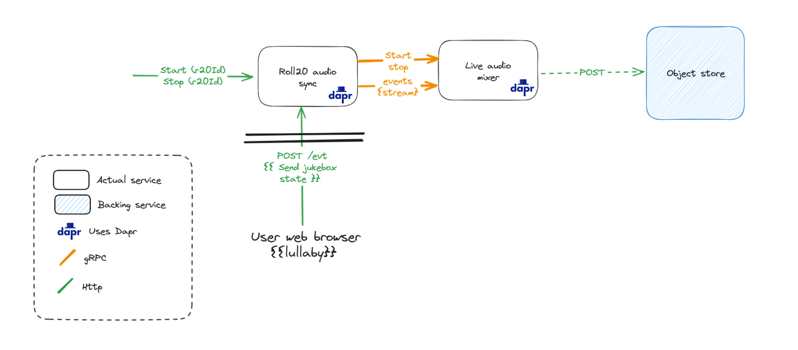

# Roll20 Audio Recorder

This project is a headless [Roll20](https://roll20.net/) audio recorder.
Its meant to record the Jukebox audio of a Roll20 game.

The recording is split between multiple services:
- A Javascript script running in the browser of a single user in a Roll20 game, listening for changes in the Jukebox and sending them to the backend
- This project, receiving the Jukebox state and breaking it into multiple audio events
- The [live audio mixer](https://github.com/SoTrxII/live-audio-mixer), receiving the audio events and mixing them into a single audio stream. Optionally, the audio stream can be piped to an object store.



## Usage

You can start and stop the recording using the `start` and `stop` endpoints of the jukeboxsyncer service.

```bash
# ID must be the ID of the Roll20 game you want to record. You can find it in the URL of the game
# https://app.roll20.net/campaigns/details/1234/my-game
curl -X POST http://localhost:50302/v1/jukeboxsyncer/start -d '{"id": "1234"}'
```

To end the recording, send a POST request to the `stop` endpoint of the jukeboxsyncer service.

```bash
# ID must be the ID of the Roll20 game you want to record
curl -X POST http://localhost:50302/v1/jukeboxsyncer/stop -d '{"id": "1234"}'
```

The recorded audio will be available in the `rec` folder of the [live audio mixer](https://github.com/SoTrxII/live-audio-mixer) project.

## Setting up the project

### Locally

Pre-requisites:
- [Docker](https://docs.docker.com/get-docker/)
- [Dapr](https://dapr.io/) >= 1.12
- [Go](https://golang.org/) >= 1.19

To start the project, clone both projects repositories
```bash
git clone https://github.com/SoTrxII/live-audio-mixer
git clone https://github.com/SoTrxII/roll20-audio-sync
    
```

Then start the project using the `start.sh` script
```bash
cd ./live-audio-mixer
dapr run -f ./deploy/roll20-recorder.yaml
```

The last step is editing the [listener script](./scripts/roll20-listener.js) to replace the `<JKBSYNC_URL>` with the URL of the evt endpoint of jukeboxsyncer service.
For a local deployment, the URL is `http://localhost:50302/v1/jukeboxsyncer/evt`.

You can then go into the roll20 game you want to record and copy/paste the script into the browser console.

### Kubernetes

[Install Dapr](https://docs.dapr.io/operations/hosting/kubernetes/kubernetes-deploy/) on the Kubernetes cluster you want to use.

You can then deploy the app 
```bash
dapr run -k -f ./deploy/roll20-recorder.yaml
```

As per locally, edit the [listener script](./scripts/roll20-listener.js) to replace the `<JKBSYNC_URL>` with the URL of the evt endpoint of jukeboxsyncer service.

You can then go into the roll20 game you want to record and copy/paste the script into the browser console.

Deploying the app on Kubernetes this way is not recommended for production. 
You can however reuse the yaml files located in .dapr/deploy to create your own deployment.


## Configuration

Here are the list of available env variables:

| Variable name | Description                                                                                                 | Required | Default value  |
|---------------|-------------------------------------------------------------------------------------------------------------|----------|----------------|
| `APP_PORT` | Port the app is listening to                                                                                | False    | `4096`         |
| `DAPR_GRPC_PORT` | Port to connect to Dapr gRPC server. This variable is set automatically when running the app with dapr run. | False    | `50001`        |